---
output: pdf_document
---
<!-- complied with pandoc -V geometry:margin=0.8in workbook.md -s -o workbook.pdf -->

#Introduction to PopChange Resource and using PopChange with QGIS  

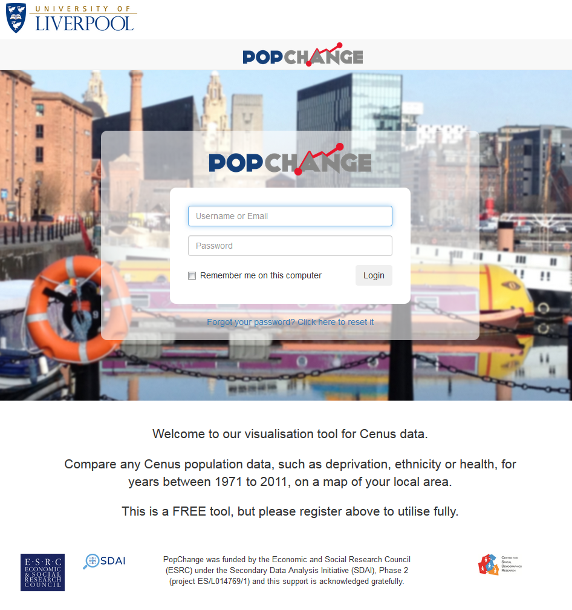{ width=50% } 

##Section 1: Using the PopChange web resource

This part of the practical shows you how to use the web resource to access the PopChange data and perform some basic comparisons of Census data between different years. To start:  

- Open up Chrome or Firefox   
- Navigate to _popchange.liverpool.ac.uk_   
- Click **Register**  
- Fill in the registration form  

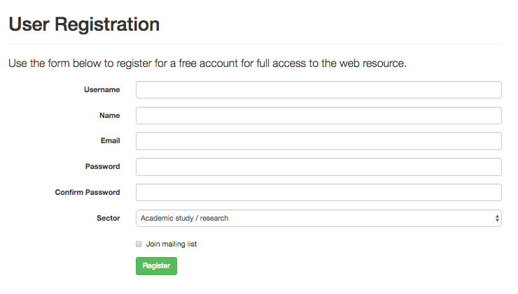{ width=35% }

*We ask for this information because the funders of the project (Economic and Social Research Council) want to know how many people use the resource and what type of work they do with it. We've tried to make it as simple as possible, but if you have any feedback, please let us know.*

- Click **Register**  
- Once you have registered, you will be taken back to the PopChange home page  
- To begin a comparison, login using the details you have just registered with  
- You will then see a screen similar to the one below:  

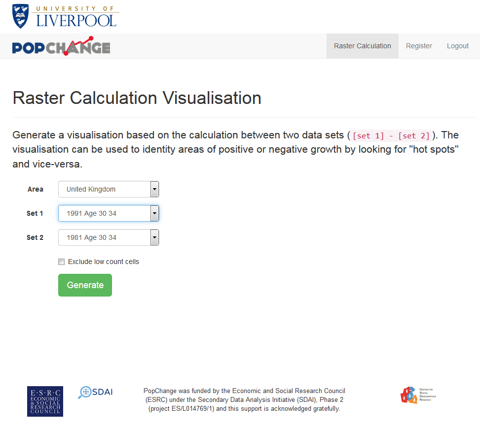{ width=50% }

- This allows you to select an area and then select the year and data set you wish to compare  

*The menus are dynamic in that they will only show you the possible comparisons based on the selections you have made so far. They will also highlight whether the comparison you have selected is meaningful (highlighted in green) or whether caution is needed (highlighted in yellow). If caution is needed, further information will be provided.*  

- Select **1991** and **Age 30 to 34** as Set 1 and **1981** and **Age 30 to 34** as Set 2  
- Click **Generate**  
- The output will be displayed on a map on the right  
- This is a map you can move about and zoom in/out <!-- There is also a transparency slider at the top to allow you to see the basemap -->  

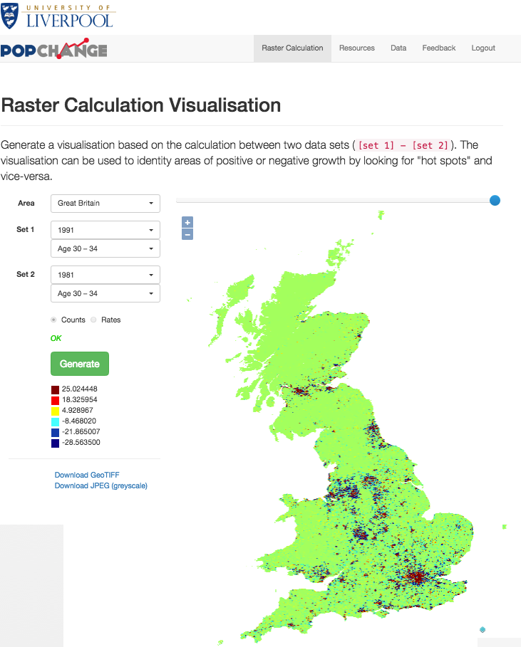{ width=50% }

The results (as a GeoTIFF for use in QGIS or a JPEG for use as a small image) can be downloaded from the links on the left. 

You can see on the map where there have been high areas of increase (dark red) and high areas of decrease (blue). Try some different combinations. 

- Which of these combinations are sensible?   
- Do the results seem realistic to you?  
- Which combinations should be used with caution? Why?   

You also have the option of limiting the map to a Local Authority of your choice (under the Area option) or excluding cells with a low population count (defined as <= 25 people). 

##Section 2: Using PopChange data with QGIS

This section of the practical shows how to perform some basic analysis on the PopChange data using QGIS. The flexibility of QGIS allows you to perform much more analysis than we show in this session, but we do not have enough time to cover every combination of things you could do with QGIS! If you want to take this further in the future, you can download QGIS from www.qgis.com and install it on your own computer. 

To begin with, we need to download the data from the website. I will use the 1991 and 1981 Age 30-34 years as an example, but you can use whichever data you like. 

- On the PopChange website click the **Data** tab  
- Click **Age**  
- Click **1991**  
- Right click on **5a_ascii_grid1991_Age_Age30_34.asc** and choose **Save target as...**  
- Save the file in your My Documents folder  
- Repeat the process for **5a_ascii_grid1981_Age30_34.asc** in the 1981 folder  

Click **Start**, type **QGIS** and click on **QGIS Desktop 2.10.1**

If you get a QGIS Tips window, you can tick the “I’ve had enough tips” tickbox to stop it opening every time you run QGIS.

Let’s start off by adding data to the map display.  

- Start by clicking the **Add Raster Layer** { height=20 } button  
- Then choose **Browse** and navigate to My Documents   
- Select one of the ASCII GRID files you downloaded from the PopChange site  
- Click **Open**  
- QGIS will ask what coordinate system the files are stored in  
- Type '27700' into the filter box and select 'OSGB 1936 / British National Grid'.  

{ width=50% }

- Click **OK**.   

This will add a layer which shows Great Britain, with a series of values in black (0) to white (the maximum value in your data, in mine it was 219.55). 
  
QGIS has a number of different ways of navigating around spatial data. Click on the Zoom In tool 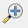{ height=20 } and draw a box around North West England – the display will zoom in to show this area. To view all of the data, click the Zoom Full { height=20 } tool.

Use the Pan Map tool 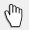{ height=20 } to move around the map by clicking on the tool and then click and drag around the map. You can also use the mouse wheel to zoom in and zoom out. Experiment with the zoom and pan tools, and when you are happy, move on to the next section of the practical. 

The Identify Features tool { height=20 } allows you to select a grid cell on the map and see the attribute information stored in the shapefile about that grid cell.

Select the identify features tool, and then click on a grid cell. 

A window will appear, titled Identify Results, with the value of the grid cell you selected. You may need to expand the window to see more of the details. Try selecting different grid cells to see the different values. 

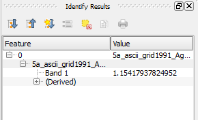

Changing the Symbology
==============

The default symbology for a raster grid in QGIS is black to white, which is OK but doesn't show changes particularly well. We can change this to a red to blue colour scheme, which shows the data much more effectively. 

- **Right click** on the raster layer and choose **Properties**  
- Select **Style** (if not already selected)  
- Change Render type from Singleband gray to **Singleband pseudocolor**  
- Change the selected value under Load min/max values to **Min / max**  
- Click **Load**  
- Click **Classify**  
- Your screen should look like the screenshot below  

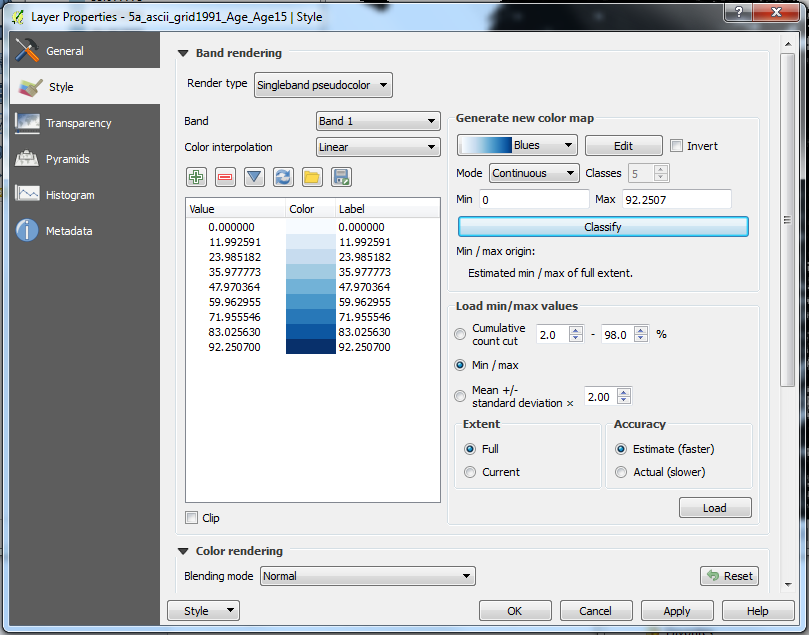{ height=50% }

- Click **OK**.  

This shows the data much more clearly. There are lots of options within the Symbology window, have a play with them if you wish. 

Raster Calculator
=================

We can also do the raster calculation of difference within QGIS, replicating what is done in the web resource. This time I will be using the count of people aged 25 - 29 from 1991 and 2001.

- Start by clicking the **Add Raster Layer** { height=20 } button  
- Then choose **Browse** and navigate to whichever folder you saved the data into  
- Select the ASCII grid file for 2001 Age 25 to 29  
- click **Open**  
- QGIS will ask what coordinate system the files are stored in  
- Type '27700' into the filter box and select 'OSGB 1936 / British National Grid'.  
- Click **OK**.   
- Repeat the process for 1991 Age 25 to 29  
  
Your QGIS window should look similar to below:  
  
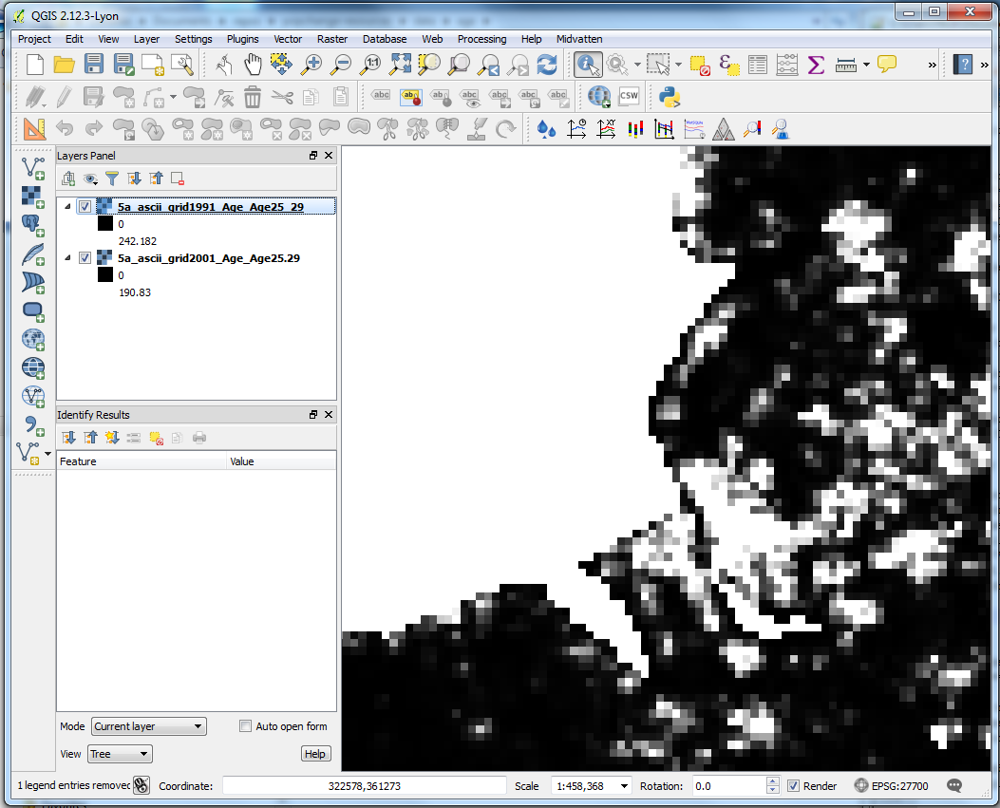{ height=40% }

- Click **Raster > Raster Calculator...**  
- Click the **...** by the output layer option  
- Choose where to save the output (I called mine **grid2001-1991-change-25-29.tif**)  
- Click **Save**  
- Double click the **2001** layer  
- Single click the minus (**-**) button  
- Double click the **1991** layer  
- You should have a calculation like this:  

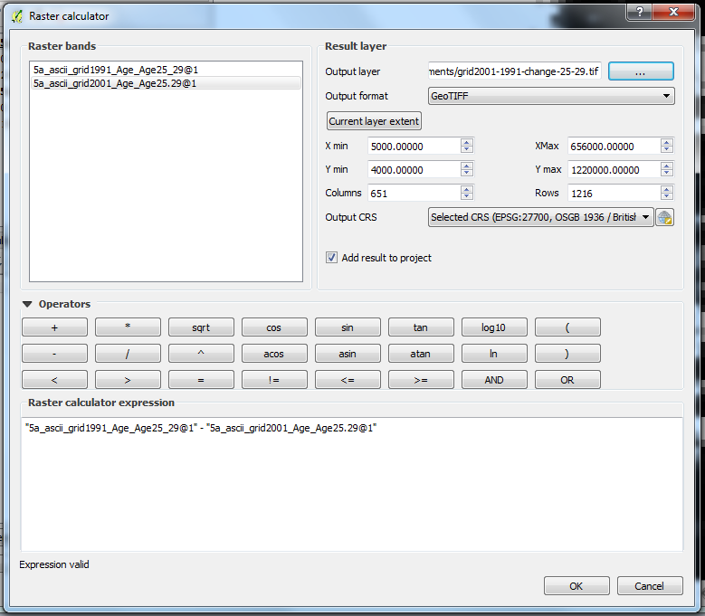{ height=40% }

- Click **OK**  

QGIS should calculate the difference between the two raster layers. 

The Raster calculator tool is very flexible so we can use it to calculate many more differences, or even calculate indices such as the Townsend score. Experiment with different symbology options to see what works best. 

Vector Version (optional)
=============

So far we have been using the raster version of the data. If you prefer to work with vector data (e.g. shape files) then this is possible. We currently provide lookup tables for each vector layer, and are planning to allow you to download shapefiles from the website in the future. 

**Be warned that the shape file for the whole of Great Britain is about quite large, about 45 MB so QGIS may struggle with it on older machines.**

- On the PopChange website click the **Data** tab   
- Right click on **vector_grid.zip** and choose **Save target as...**  
- Save the file in your My Documents folder  
- Extract the files from vector_grid.zip by right-clicking on it, choosing **Extract All...** and follow the on-screen instructions  

We also need the lookup table for the variable we are using

- On the PopChange website click the **Data** tab  
- Click **Age**  
- Click **1991**  
- Right click on **lookup_1991_Age_Age30_34.csv** and choose **Save target as...**  
- Save the file in your My Documents folder  
- Repeat the process for **lookup_1991_Age_Age30_34.csvt** and save it in the same folder  

In order to join tabular data it is necessary that both of your datasets have a common attribute (e.g. a name, unique reference or code). This attribute must be unique (i.e. a code must not be listed twice in your Attribute table) and identical (i.e. the codes must be the same).

- Click the **Add Vector Layer** { height=20 } button  
- Then choose **Browse** and navigate to whichever folder you saved the **vector_grid.zip** data    
- Select the **vector_grid.shp** file  
- click **Open**  
- click **Open**  
- Right click on the vector_grid layer and select **Open Attribute Table**. You’ll see that the GRIDCODE field is unique for each grid cell.   
- Close the Attribute table.  

The vector lookup table is saved as a CSV file (lookup_1991_Age_Age30_34.csv). Open it in Excel if you wish to take a look. We also have a CSVT file which stores the field types (lookup_1991_Age_Age30_34.csvt) 

The fields we are joining are CODE from the vector grid file and grid_ID from the Lookup table. 

Now that we’ve identified the two fields in our datasets that we will use to make the join we can move on. 

- Firstly, add the lookup table using **Add Vector Layer** { height=20 } button  
- Click on this now and **Browse** to where you have saved the data files  
- Select **lookup_1991_Age_Age30_34.csv** (if it doesn’t show, change the box next to File Name from ESRI Shapefiles to All files) and click Open, and click Open again  

The table will now appear as a layer in the Layers window:

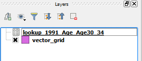

Right-click on the table and Open Attribute Table to check that the data appear correctly (if you have all <null> values there has been a problem importing your data (try removing it from the Layers window and add it again. If it doesn’t work, ask for help)). 

Now we will join this table layer with your spatial data. Right-click on the vector_grid layer, select Properties and click on the Joins option

Click on the plus  button to create a new join. The Add Vector Join dialogue box will now open.  

- Make sure that pop_2011 is selected in the **Join layer** dropdown box  
- **grid_ID** should be selected in the **Join field** dropdown box  
- **GRIDCODE** should also be selected in the **Target field** dropdown box  

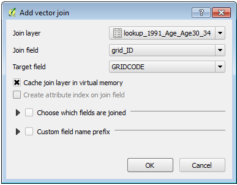{ height=30% }

Hit **OK** on the Add vector join window and also in the Layer Properties window

Open Attribute Table of vector_grid and you will see that a new field (named lookup_1991_Age_Age30_34) has been added to the Attribute table! Please ask for help if this is not the case.

The join that we have made is not permanent; it is a temporary link between the two datasets. To make the Join permanent we need to save a new copy of the vector_grid layer.

- Right-click **vector_grid** and click on **Save as**  
- In the Save vector layer as window make sure that the following variables are selected:  
- **Format** is **ESRI Shapefile**  
- Save the new layer as vector_grid_1991_age_30_34  
- Leave all other fields as they are  
- Check the checkbox next to **Add saved file to map**  
- Hit **OK** and the new layer will be added to the map  
- Open the attribute table to check that the new field is present  
- Right-click **vector_grid** and select **Remove**  
- If you like, Save your project.  

Clipping out a Local Authority
===========

We can select out data for a specific local authority or any other shape file boundary we already have. QGIS is very particular about the projection the data are in so we need to save the existing ASCII grid as a GeoTIFF (which will explicitly include the projection information). *This also applies to GeoTIFFs downloaded from the web resource - they need to be saved again with projection information before they can be clipped.*)

- Using the ASCII grid which you already have open (probably 2001 Age 25 to 29)
- Right click on the layer, and choose **Save As**  
- Click **Browse** and choose a suitable file name  
- Click **Save** and **OK**  
- This will add a new layer into QGIS with the correct projection information. 

We can then download the data we want to use.  

- On the PopChange website click the **Data** tab   
- Click **local_authority_boundaries**  
- Right click on one of the Local Authority zip files and choose **Save target as...**  
- Save the file in your My Documents folder  
- Unzip the file and open in QGIS  
- Once the file is added, right click on the Local Authority layer and choose **Zoom to Layer**   
- Your screen should look similar to the below:  

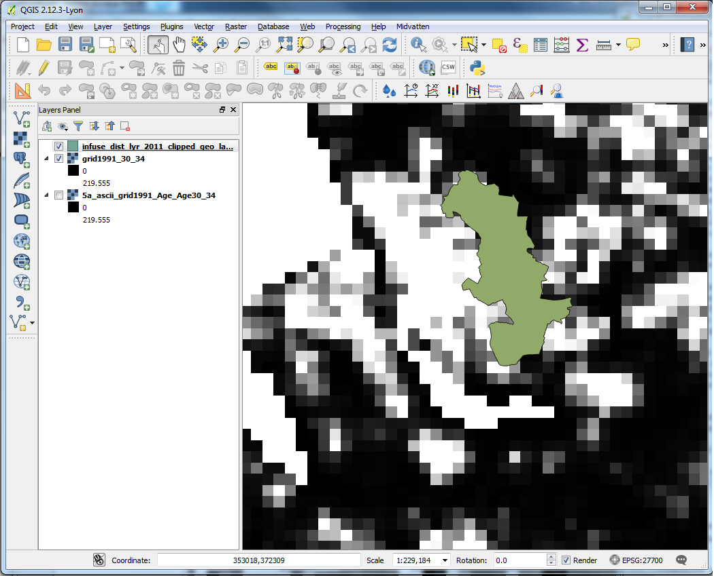{ width=50% }

- Select **Raster > Extraction > Clipper...**  
- Select the input raster file you have saved above (mine was **grid1991_30_34**)  
- Set the output file by clicking on **Select..** by output file and give it a suitable name  
- Under Clipping mode select **Mask layer**  
- Ensure the layer selected is the vector layer you want to use for the clip  
- Click **OK**  

This will create a clipped layer for your selected Local Authority. Turn off the other layers to see the output. You can apply this to any vector layer if you want to clip out a different area. 

Alternatively, you can select out your own local authority from the whole data file. 

- On the PopChange website click the **Data** tab     
- Click **local_authority_boundaries**  
- Right click on **LA_split.zip** and choose **Save target as...**  
- Save the file into **My Documents**  
- Extract the files  by double-clicking the file and following the instructions  
- Open QGIS  
- Click **Add Vector Layer...** and navigate to **My Documents > LA_split**  
- Add the shapefile for whichever local authority you wish to use   
- Right click on the local authority layer and choose **Zoom to Layer**   
- Continue with the instructions above   

Histogram
=====

Within QGIS we can look at the properties and histogram of the raster data. This can tell us some useful information about the values within the raster, which might be useful for further analysis. 

- Right click on the vector layer   
- Choose **Properties**   
- Select **Metadata**  
- Within the **Properties** window scroll down to the **Band 1** section. It should look like this:  

{ width=40% }

- This gives us the max, mean, min and standard deviation values.  
- Click **Histogram**.  
- This shows the whole data set and as you can see the data are very skewed, i.e. most of the values are quite low.  
- We can Zoom In on this - draw a box around the bottom left hand quarter of the histogram. QGIS will then zoom in on this section.  
- Across the x-axis we can see the pixel values - in the example below we can see most of the values are at or below 2. 

{ width=40% }
  
    
    
    
    
-----------------------------------------------------------------------

This practical was supplied by Clear Mapping Co. 

*Clear Mapping Company is an award-winning international cartographic design consultancy. We create beautiful maps to improve efficiency in the workplace with an inclusive and sustainable design focus.*

*Our bespoke GIS training courses offer the opportunity to improve efficiency handling spatial data and creating clear maps.*

PopChange is funded by the Economic and Social Research Council (ESRC) under the Secondary Data Analysis Initiative (SDAI), Phase 2 (project ES/L014769/1) and this support is acknowledged gratefully. The Office for National Statistics are project partners. The research builds on the British Academy/Leverhulme Trust Small Research Grant Scheme funded project ‘Generating population surfaces for England and Wales using information on landuse and the spatial structure of population variables’ (SG121849), which ran from 2013 to 2014. The project is based with the University of Liverpool’s cross-disciplinary Centre for Spatial Demographics Research. For more information see: https://www.liverpool.ac.uk/geography-and-planning/research/popchange/introduction/

This practical was written by Nick Bearman (nick@clearmapping.co.uk) for QGIS 2.10.1. This work is licensed under the Creative Commons Attribution-ShareAlike 4.0 International License. To view a copy of this license, visit http://creativecommons.org/licenses/by-sa/4.0/deed.en.  

The latest version of the PDF is available from https://github.com/ClearMappingCo/popchange-documentation. This practical is written in Markdown, and compiled using Pandoc 1.17.1, tested on Windows 7 and OSX Yosemite (10.10.5).
