---
output: pdf_document
---
<!-- complied with pandoc -V geometry:margin=0.8in workbook.md -s -o workbook.pdf -->

#Using PopChange data to create an article ready map

| Learning outcomes:  | Tools & techniques:  |
|---|---|
| Designing and producing an article ready map in QGIS  | Map Composer |
| How to add and edit legends | Overview maps  |
| Saving/exporting your maps as image files |  Exporting data |

This practical shows you how to use the PopChange data to create an article ready map. It focuses on aspects of map design and symbolisation in QGIS. An example of the map is provided at the end of this handout.

Using the web interface allows you to create a simple map you can include in your reports. However if you want to customise the map, change the layout, colour scheme or focus on an area that is not a Local Authority provided within the interface, then you can do this within QGIS. 

Firstly, we need to download some data. 

##Download data

- Navigate to the PopChange website [http://popchange.liverpool.ac.uk](http://popchange.liverpool.ac.uk), login and pick two variables to perform a comparison. I will be comparing Age 0 - 14 count between 2011 and 2001 for Great Britain. *More details are available in the first practical.* 
- Select the **Download GeoTIFF** link to download the data in a GeoTIFF format. Save this file somewhere you can find it. 
- Open QGIS and add the GeoTiff file you have just downloaded, using the **Add Raster Layer** 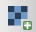{ height=20 } button. 
- QGIS will ask you what coordinate system the data are in - select **OSGB 1936 / British National Grid, EPSG:27700**. Type **27700** into the search bar, select the correct entry and click ok. 

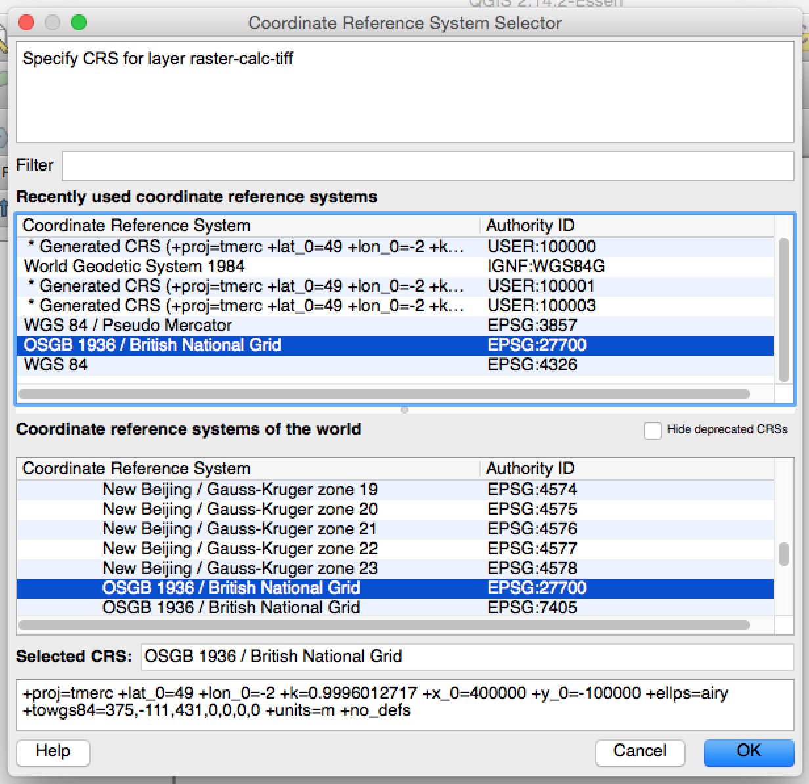{ width=40% }

The data will appear, although only in black and white. 

- Right click on the raster layer, and choose **Properties**. 
- Go to the **Style** tab. 
- Set **Render type** to **Singleband pseudocolor**. 
- Under **Generate new color map**, select **Purples**. 
- Click **Classify** (the Properties window should look like the example below, although the numbers will be different depending on the data you have chosen). 
- Click **OK**.

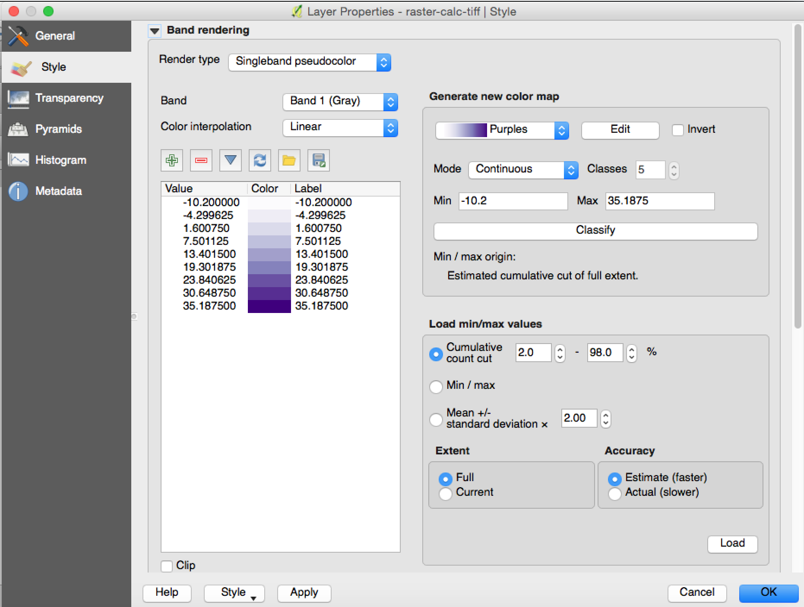{ width=60% }

The values QGIS has in the Layers window next to each colour are mid points for each colour category. For example, the darkest purple (at the bottom of the list) has a mid point value of 28.60. This means that some values in this category will be below 28.60 and some will be above. The whole data set is stretched between white and dark purple. 

<!-- Comment out for future development, when we add a section on sybbolising the vector version of the data -->
<!-- If you want a strictly categorical output, then it is better to use the shapefile output (see below). -->

QGIS supports many different colour options. ColorBrewer is a range of very useful pallets, designed to ensure that all of the colours are distinctive and clear. I would recommened having a look at [ColorBrewer.org](http://ColorBrewer.org) and selecting the most appropriate scheme for your map. 

- Once you know which colour scheme you want to you, right click on the raster layer, and choose **Properties**. 
- Go to the **Style** tab. 
- Under **Generate new color map**, scroll right to the bottom and select **New color ramp**. 
- Select **ColorBrewer** and choose **OK**. 
- Pick the Scheme name that you want to use. I am selecting **GnBu**. 
- Select how many colours you want - I am selecting **7**. 
- Choose **OK**. 
- Give the colour ramp a name, and click **OK**. 
- Click **Classify**. 
- Click **OK**.

The map will update with your new colour scheme. Zoom in to see the variation in colours more easily. 

##Print Composer

Now we have the data classified as we want it, we can setup the rest of the map. QGIS has a powerful tool called Print Composer which allows us to design and create a good looking map, with all the required map 'marginalia' include. These are things like the title, legend, scale, data sources, north arrow and so on. 

- Go to **Project > New Print Composer**. 
- Give your map a name (you can have multiple maps, for example if you need to do maps of different areas or different scales) 
- The defaults are for a portrait A4 map. This is fine for a map of Great Britain, but if you are doing a map of an area that is wider than it is high (e.g. Cornwall) then a landscape map might be more useful. 
- Click **Add new map** 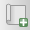{ height=20 } and draw a rectangle on the canvas that fills most of the page. 
- Click **Layout > Add Legend** and click towards the bottom left hand corner of the map. 
- Click **Layout > Add Scalebar** and click towards the bottom right hand corner of the map. 
- We now have most of the elements we need on the map. If you want to move any of them about, make sure the **Select/Move item** tool is selected 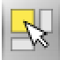{ height=20 } and then any of the elements can be selected and dragged around the page. 
- If you need to move the map data around inside the Map, select the **Move item content** 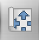{ height=20 } tool (the one below the Select/Move item tool. This allows you to move the map data around, inside the map frame. Remember to switch back to **Select/Move item** { height=20 } before you go on to anything else! 
- When you select each item, the **Item Properties** window on the right will change. In it there will be lots of different options, relevant to that item. 

*If you need to undo a change you have made, there are the green undo / redo arrows at the top of the window 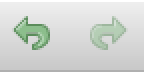{ height=20 }  or the Command History window (at the top-right) which lists all the steps you have taken from the beginning.*
 
- All the details of the Print Composer project are saved with the project file (.qgs). It's a good idea to save your Map Project regularly. To do this, click the Save project button 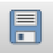{ height=20 } at the top left. *Be sure to avoid the Save as template button, which looks similar but has a green box with a white line in the bottom right corner.*

- Click **Layout > Add Label** and draw a rectangle for the title at the top of the map. Under Item Properties, update the text that says QGIS to a suitable title for the map (*Changes in number of people aged X to X between X and X*). 
- Set the **Horizontal Alignment** to **Center**. 
- Click **Font...** and select a suitable size and style for the title, such as 24. 
- Repeat this process to add the data sources (listed below) and any other text you wish at the bottom of the page.  
  
*Data sourced from PopChange website (http://popchange.liverpool.ac.uk) containing Census data from ONS (Office for National Statistics) and NRS (National Records of Scotland).* 

- Select the scale bar we added earlier. Style this as you wish - I would suggest setting **Segments left** to **0** and **Segments right** to **5**. Sometimes the scale bar in QGIS can be a bit tricky - if yours is being troublesome, these are the settings you need:

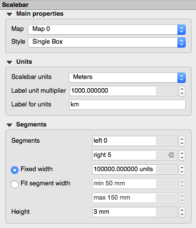{ width=40% }

- Select the legend we added earlier. Currently it has the name of the layer (*rcalc*) and the mid-point values for each colour classification. We can tidy this up within the Print Composer. 
- Make sure the legend is selected, and uncheck the **auto-update** checkbox. Auto-update allows QGIS to add and edit items in the legend based on what layers you have added to the map. Unchecking it allows us to edit it manually. 
- Select the **rcalc** entry and then click on the **Edit** 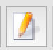{ height=20 } button. 
- Delete all the text and choose **OK**. 
- We can also edit the mid-point values in the same way. Double click on each, and change the values to 1 decimal place. 
- It will also look better if we remove the black border. Scroll down to **Symbol** and uncheck **Draw border for raster symbols**. 
- There are many other options - have an explore to see what they do. 

##Exporting the map

Once we have the map laid out as we want it, we can to export the map. There are a number of different formats we can export the map as, including PNG, JPG or PDF. To export, click either **Export as image** 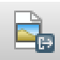{ height=20 } or **Export as PDF** 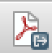{ height=20 } and follow the on screen instructions. Your map should look something like the one at the end of the handout. 

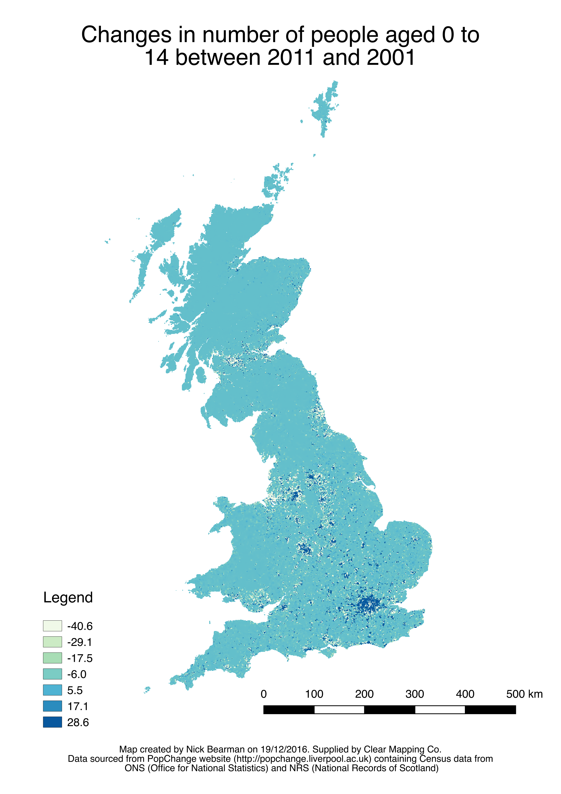{ width=80% }

##Adding Local Authority boundaries (optional exercise)

To give your map some context, you can add a local authority boundary, or any other sort of boundary. You can download these from a range of different sources, including [Ordnance Survey Open Data](https://www.ordnancesurvey.co.uk/business-and-government/products/opendata-products.html). 

- Once you have your boundary shape file, add it to QGIS and choose a suitable symbology. 
- I used a red outline, with a width of 0.46. 
- Return to the Print Composer window (**Project > Print Composer > Composer 1**)
- To update the map preview, ensure the Map is selected, and then click **Update preview** in the Item properties window. 
- You may need to add the boundary layer to the legend. If so, click the **Add Layer to Legend** button { height=20 } and select the boundary layer. If necessary, you can rename the layer using the same method as we used earlier. 

*As well as editing the layer labels in the legend, you can change them in the main QGIS window. If you leave Auto Update selected in the legend options, then the information will update automatically.*

##Adding a Inset Map (optional exercise)

Depending on your audience for your map, it may be valuable to provide a context map, i.e. a map showing the area of your map in the context of the UK. 

- In the Map Composter, select the map and, in **Item Properties**, select the checkbox that says **Lock layers for map item**. 
- Return to the main QGIS window, and adjust the layers and symbology to how you wish the context map to look. 
- Return to the Map Composer window, and click **Add new map** { height=20 } and draw a rectangle where you wish the contect map to be. 
- In **Item Properties**, scroll down **Overviews** and click the black arrow to expand the options. 
- Click the green plus, and a new overview (Overview 1) will appear in the list. 
- Change **Map Frame** to **Map 0** and you should see a red box appear in the context map, showing the area shown by the main map. 
- Adjust the frame style to whichever colour and style you wish. I prefer an outline box showing the area. 
- Select the context map, and make sure you select **Lock layers for map item**, as you did before. 

Now you can adjust the styles for each map independently. If you change which layers are visible, you will need to uncheck, update preview and recheck the **Lock layers for map items** option. 
    
-----------------------------------------------------------------------

This practical was supplied by Clear Mapping Co. 

*Clear Mapping Company is an award-winning international cartographic design consultancy. We create beautiful maps to improve efficiency in the workplace with an inclusive and sustainable design focus.*

*Our bespoke GIS training courses offer the opportunity to improve efficiency handling spatial data and creating clear maps.*

PopChange is funded by the Economic and Social Research Council (ESRC) under the Secondary Data Analysis Initiative (SDAI), Phase 2 (project ES/L014769/1) and this support is acknowledged gratefully. The Office for National Statistics are project partners. The research builds on the British Academy/Leverhulme Trust Small Research Grant Scheme funded project ‘Generating population surfaces for England and Wales using information on landuse and the spatial structure of population variables’ (SG121849), which ran from 2013 to 2014. The project is based with the University of Liverpool’s cross-disciplinary Centre for Spatial Demographics Research. For more information see: https://www.liverpool.ac.uk/geography-and-planning/research/popchange/introduction/

This practical was written by Nick Bearman (nick@clearmapping.co.uk) for QGIS 2.14. This work is licensed under the Creative Commons Attribution-ShareAlike 4.0 International License. To view a copy of this license, visit http://creativecommons.org/licenses/by-sa/4.0/deed.en.  

The latest version of the PDF is available from https://github.com/ClearMappingCo/popchange-documentation. This practical is written in Markdown, and compiled using Pandoc 1.17.1, tested on Windows 7 and OSX Yosemite (10.10.5).
