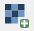
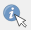
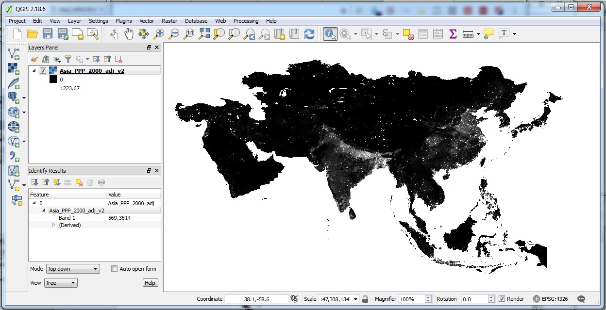
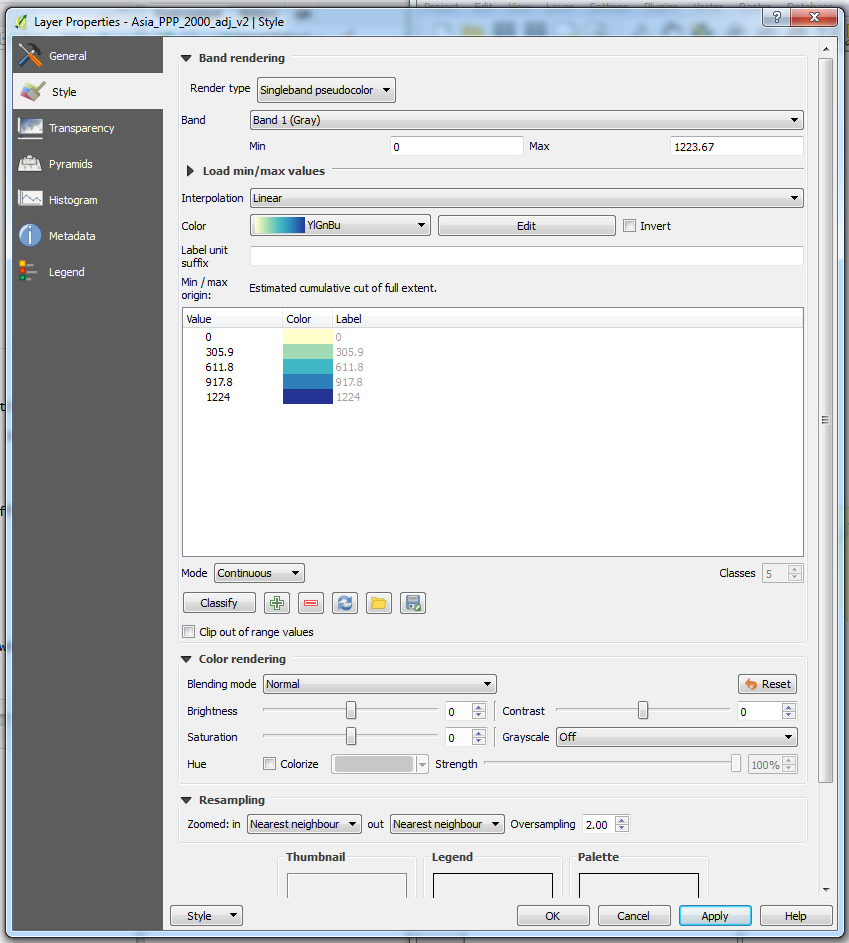
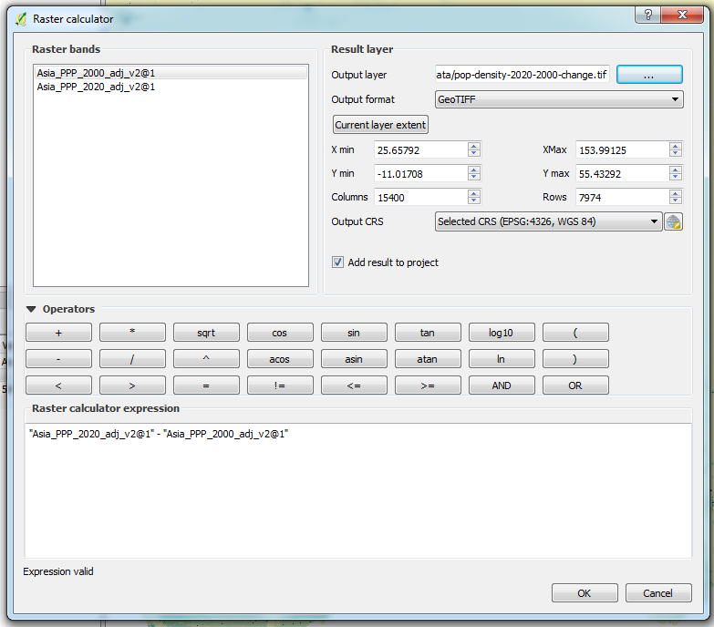
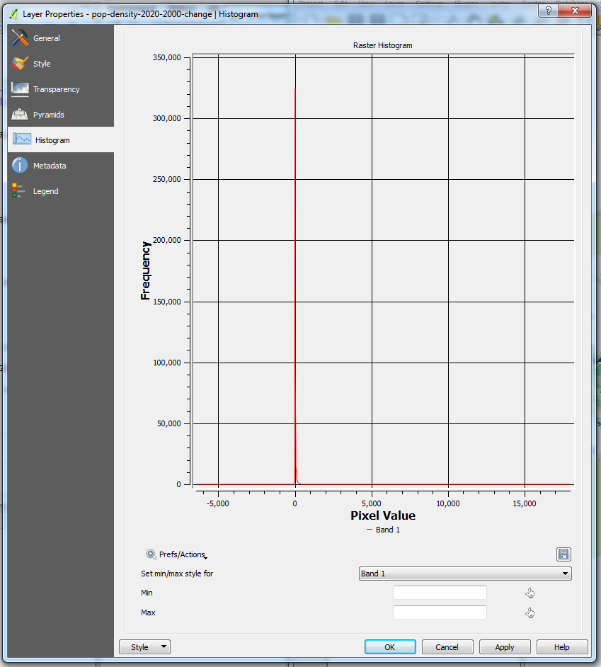

<!-- complied with pandoc -V geometry:margin=0.8in workbook.md -s -o workbook.pdf -->
<!-- also compilable within RStudio -->

| Learning Outcomes: |
| -- | -- |
| Use QGIS to read in raster data (pg. 1)  | 
| Customize colour & symbology (pg. 1)  | 
| Use Raster Calculator to calculate change over time (pg. 3) |
| View raster histogram (pg. 4) |
<!-- Tables have a max line length, if it is too long, the table gets shrunk -->

##Reading in Raster Data

We will be using some raster data in QGIS in this practical. Raster data are continuous grids of pixels, each of which holds a value. QGIS has a tool called **Raster Calculator** which allows us to perform some basic analysis of raster data. 

In this practical, we will be looking at some continent level population density data. The WorldPop data is provided by the GeoData Institute at the University of Southampton. More details available at 
http://www.worldpop.org.uk/. 

- Go to the **Population Density Grid download page** at http://www.worldpop.org.uk/data/data_sources/ 
- Select **Population - whole continent** 
- Under **Asia** select **Summary Page >** 
- On this page, you are asked to provide your details before you download the data. 

*Often government or academic data suppliers ask for people to register, so the number of users can be logged. This is fairly common, and allows the department to justify their funding, by saying "X thousand users have downloaded and used our data".* 

- Enter your details, and click **Browse Individual Files** 
- Download the 2000 data **Asia_PPP_2000_adj_v2** and the 2020 data **Asia_PPP_2020_adj_v2** 
- Once the data have download, extract them and save them in your working folder for today 

Now we can open QGIS and load in the data. 

- Start by clicking the **Add Raster Layer** { height=20 } button 
- Then choose **Browse** and navigate to your working folder 
- Select the file for 2000 you downloaded earlier
- Click **Open** 
- This will add the data to QGIS, currently just in black and white 
- Use the { height=20 } to select a grid cell on the map and see the associated information 

{ width=60% }

##Changing the Symbology

The default symbology for a raster grid in QGIS is black to white, which is OK but doesn't show changes particularly well. We can change this to a light yellow to blue colour scheme, which shows the data much more effectively. 

- **Right click** on the raster layer and choose **Properties** 
- Select **Style** (if not already selected) 
- Change Render type from Singleband gray to **Singleband pseudocolor** 
- Change the **Color** to **YlGnBu** (or something else if you wish) 
- Click **Classify** 
- Your screen should look like the screenshot below 

{ height=50% }

- Click **OK**. 

The map should appear with colours on, with darker blues representing higher population densities. 

This shows the data much more clearly. There are lots of options within the Symbology window, have a play with them if you wish. Some of them are much more useful than others for this type of data. 

- Repeat the process above for year 2000 data. 

You could compare the data from the different years by turning layers on and off, but it's difficult to see the changes. For example, there are some in eastern China and northern India.

##Raster Calculator

We can use the raster calculator tool to calculate the difference between the two layers. 

- Click **Raster > Raster Calculator...** 
- Double click the **2020** layer (you may need to scroll to the right to see which layer is which) 
- Single click the minus (**-**) button 
- Double click the **2000** layer 

*When calculating differences, the first layer should be the most recent date (e.g. 2020) and the second layer should be the older date (e.g. 2000). Then positive values are increases and negative values are decreases.* 

- Click the **...** by the output layer option 
- Choose where to save the output (I called mine **pop-density-2020-2000-change.tif**) 
- Click **Save** 
- You should have a raster calculator window like this: 

{ height=50% }

- Click **OK** 

*The processing might take some time, depending on how powerful the computers are. If you get an "insufficient memory" error or similar, it may be that the data are too big. Instead, try downloading data for a single country, e.g. Egypt (unfortunately, Lebanon does not have population data available on the WorldPop website).*

QGIS should calculate the difference between the two raster layers. Once it has created the layer, try symbolising it like we did with the earlier layers. Where are the biggest differences?

##Histogram

Within QGIS we can look at the properties and histogram of the raster data. This can tell us some useful information about the values within the raster, which might be useful for further analysis. 

- Right click on the vector layer 
- Choose **Properties** 
- Click **Histogram** 
- This shows the whole data set and as you can see the data are very skewed, i.e. most of the values are quite low. 
- We can Zoom In on this - draw a box around the bottom left hand quarter of the histogram. QGIS will then zoom in on this section. 
- Across the x-axis we can see the pixel values - in the example below we can see most of the values are at or below 500. 
- To zoom back out of the histogram, click **Prefs/Actions > Recompute Histogram**. 

{ width=50% }
  
    
    
    
    
-----------------------------------------------------------------------

This practical was supplied by Clear Mapping Co. 

*Clear Mapping Company is an award-winning international cartographic design consultancy. We create beautiful maps to improve efficiency in the workplace with an inclusive and sustainable design focus.*

*Our bespoke GIS training courses offer the opportunity to improve efficiency handling spatial data and creating clear maps.*

This practical was written by Nick Bearman (nick@clearmapping.co.uk) for QGIS 2.18.6. This work is licensed under the Creative Commons Attribution-ShareAlike 4.0 International License. To view a copy of this license, visit http://creativecommons.org/licenses/by-sa/4.0/deed.en.  

This work is based on Introduction to PopChange Resource and using PopChange with QGIS (forked from https://github.com/ClearMappingCo/popchange-documentation) and Basic Raster Styling and Analysis by Ujaval Gandhi (twitter.com/spatialthoughts, http://www.qgistutorials.com/en/docs/raster_styling_and_analysis.html). 

The latest version of the PDF is available from https://github.com/nickbearman/qgis-using-raster-data. This practical is written in Markdown, and compiled using Pandoc 1.17.1, tested on Windows 7 and OSX Yosemite (10.10.5).